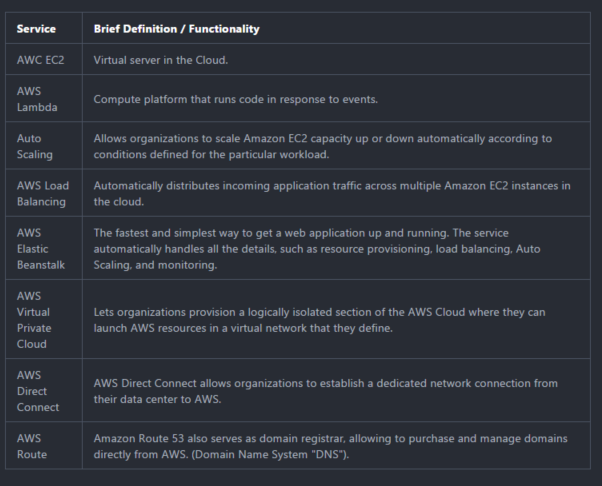
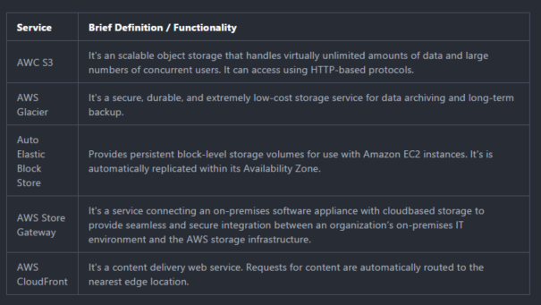
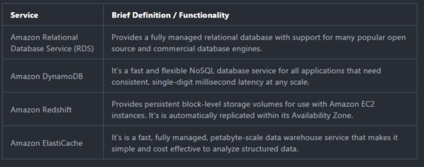
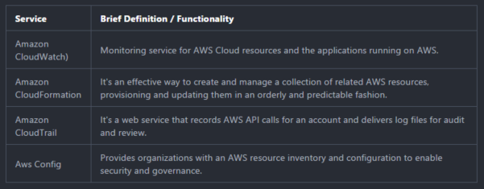
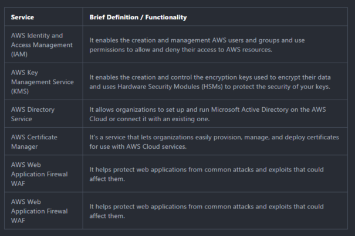
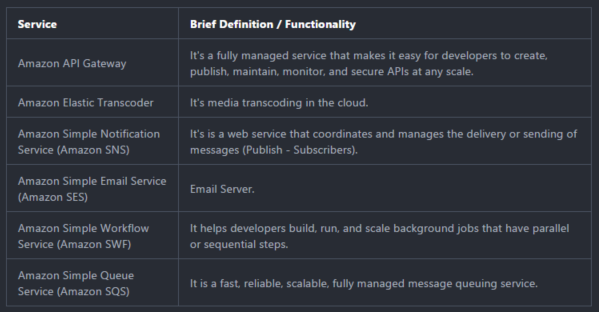

<h1 align= "center" style="margin-top: 3cm">   Cloud Computing Basics</h1>
<h3 align= "center" style="margin-top: 3cm"> By Erick Coral</h3>

---

## WHAT IS CLOUD COMPUTING?

“Cloud computing refers to both the applications delivered as services over the Internet and the hardware and systems software in the data centers that provide those services . ”

---

## WHAT IS CLOUD COMPUTING?

“ Cloud computing is a model for enabling ubiquitous, convenient, on-demand network access to a shared pool of configurable computing that can be rapidly provisioned and released with minimal management effort or service provider interaction.   ”

---

## CLOUD HISTORY AND TIMELINE

---

## TOP CLOUD VENDORS

---

## CLOUD SERVICE MODELS

---

<h1 align="center" style="margin-top : 1cm"> AWS BASIC CONCEPTS</h1>

---

## BASIC CONCEPTS

<ul>
 <li> AWS provides technology infrastructure located in multiple locations worldwide. These locations are composed of <strong>Regions</strong> and <strong>Availability Zones</strong>.
</ul>

---

## BASIC CONCEPTS

###  Regions

 * An AWS region is a physical geographical location that consists of a cluster of data centers
 * Each region  is completely independent and isolated from the other ones.

###  Availability Zone

 * An Availability Zone is one or more data centers within a region that are designed to be isolated from failures.
 * Availability Zones provide inexpensive, low-latency network connectivity to other zones in the same regions.

---

## CLOUD COMPUTING DEPLOYMENT MODELS

###  All-in cloud-based application

 * It is  when an applications is fully deployed in the cloud.
 * The application could have been created from scratch or migrated from an existing infrastructure.
 * Cloud-based applications can use  low-level infrastructure or high-level services provided by AWS.  

###  Hybrid deployment Model

 * It is an architectural pattern providing connectivity for infrastructure and applications between cloud-based resources and existing resources that are not in the cloud.

---

## COMPUTING AND NETWORK SERVICES

AWS provides a variety of compute and networking services to deliver core functionality for businesses to develop and run their workloads.

---

## COMPUTING AND NETWORK SERVICES

---

## STORAGE AND CONTENT DELIVERY

---

## STORAGE AND CONTENT DELIVERY

---

## DATABASE SERVICES

AWS provides fully managed relational and NoSQL database services, and in-memory caching
as a service and a petabyte-scale data warehouse solution.

---

## DATABASE SERVICES

---

## MANAGEMENT TOOLS

AWS provides a variety of tools that help organizations manage their AWS resources.

---

## MANAGEMENT TOOLS

---
## SECURITY AND IDENTITY

AWS provides security and identity services that help organizations secure their data and
systems on the cloud.

---

## SECURITY AND IDENTITY

---
## APPLICATION SERVICES

AWS provides a variety of managed services to use with applications.

---

## APPLICATION SERVICES

---

## REFERENCES

<li> The NIST Definition of Cloud Computing, Peter Mell – Timothy Grance. September 2011.
<li> Armbrust, M., Stoica, I., Zaharia, M., Fox, A., Griffith, R., Joseph, A., Katz, R., Konwinski, A., Lee, G., Patterson, D. and Rabkin, A. (2010). A view of cloud computing. Communications of the ACM, 53(4), p.50
<li>Baron, J., Baz, H., Bixler, T., Gaut, B., Kelly, K. E., Senior, S., & Stamper, J. (2017). AWS Certified Solutions Architect official study guide: Associate exam. United States: Sybex, a Wiley brand.

