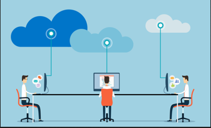
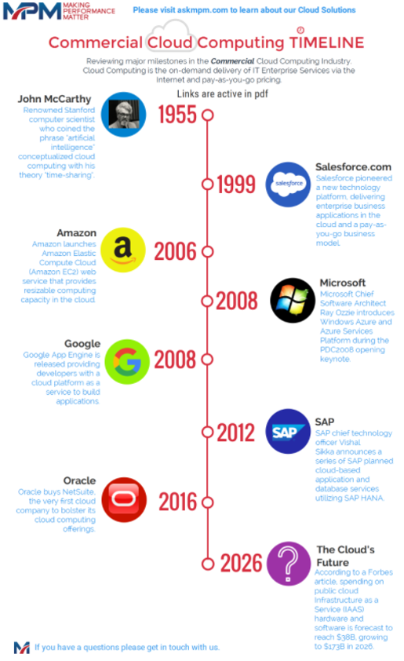
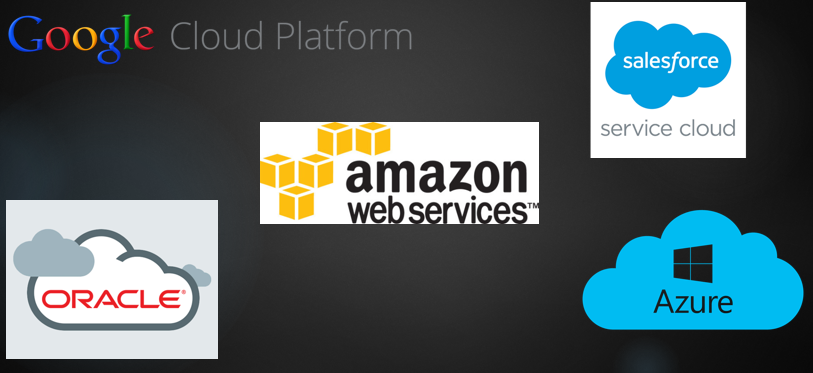
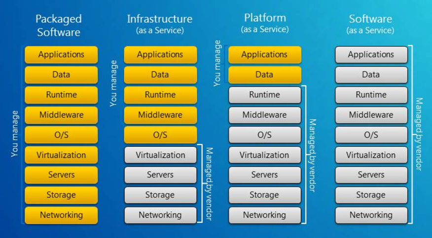
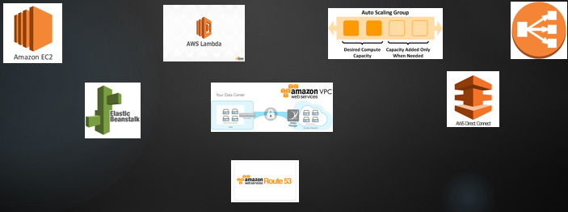
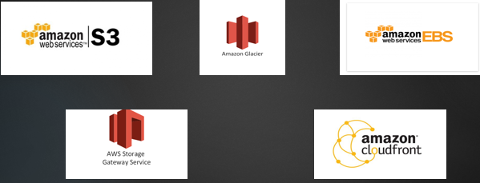
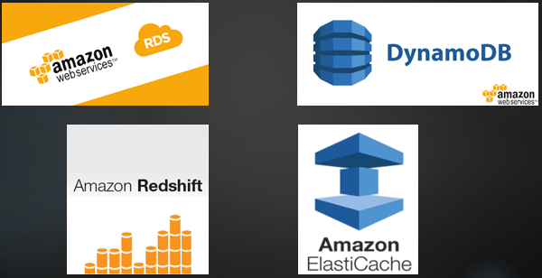
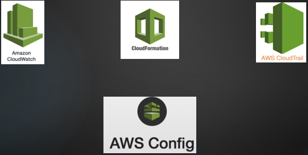
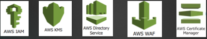
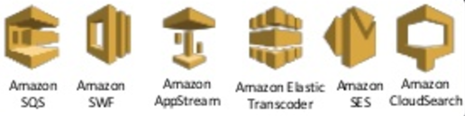

class: center, middle

## Cloud Computing Basics
### By Erick Coral

---

## WHAT IS CLOUD COMPUTING?

“Cloud computing refers to both the applications delivered as services over the Internet and the hardware and systems software in the data centers that provide those services . ”

---

## WHAT IS CLOUD COMPUTING?

“ Cloud computing is a model for enabling ubiquitous, convenient, on-demand network access to a shared pool of configurable computing that can be rapidly provisioned and released with minimal management effort or service provider interaction.   ”

---

## CLOUD HISTORY AND TIMELINE

---

## TOP CLOUD VENDORS

  

---

## CLOUD SERVICE MODELS

---

<h1 align="center" style="margin-top : 1cm"> AWS BASIC CONCEPTS</h1>

---

## BASIC CONCEPTS

<ul>
 <li> AWS provides technology infrastructure located in multiple locations worldwide. These locations are composed of <strong>Regions</strong> and <strong>Availability Zones</strong>.
</ul>

---

## BASIC CONCEPTS

###  Regions

 * AWS region is a physical geographic location that consists of a cluster of data center.
 * Each region  is completely independent and isolated from the other ones.

###  Availability Zone

 * An Availability Zone is one or more data centers within a region that are designed to be isolated from failures.
 * Availability Zones provide inexpensive, low-latency network connectivity to other zones in the same regions.

---

## CLOUD COMPUTING DEPLOYMENT MODELS

###  All-in cloud-based application

 * It is  when an applications is fully deployed in the cloud.
 * The application could have been created from scratch or migrated from an existing infrastructure.
 * Cloud-based applications can use  low-level infrastructure or high-level services provided by AWS.  

###  Hybrid deployment Model

 * It is an architectural pattern providing connectivity for infrastructure and applications between cloud-based resources and existing resources that are not in the cloud.

---

## COMPUTING AND NETWORK SERVICES

AWS provides a variety of compute and networking services to deliver core functionality for businesses to develop and run their workloads.

---

## COMPUTING AND NETWORK SERVICES

Service | Brief Definition / Functionality
------------ | -------------
AWC EC2 | Virtual server in the Cloud.
AWS Lambda | Compute platform that runs code in response to events.
Auto Scaling | Allows organizations to scale Amazon EC2 capacity up or down automatically according to conditions defined for the particular workload.
AWS Load Balancing| Automatically distributes incoming application traffic across multiple Amazon EC2 instances in the cloud.
AWS Elastic Beanstalk | The fastest and simplest way to get a web application up and running. The service automatically handles all the details, such as resource provisioning, load balancing, Auto Scaling, and monitoring.
AWS Virtual Private Cloud | Lets organizations provision a logically isolated section of the AWS Cloud where they can launch AWS resources in a virtual network that they define.
AWS Direct Connect | AWS Direct Connect allows organizations to establish a dedicated network connection from their data center to AWS.
AWS Route  | Amazon Route 53 also serves as domain registrar, allowing to purchase and manage domains directly from AWS. (Domain Name System "DNS").

---

## STORAGE AND CONTENT DELIVERY

---

## TORAGE AND CONTENT DELIVERY

Service | Brief Definition / Functionality
------------ | -------------
AWC S3 | It's an scalable object storage that handles virtually unlimited amounts of data and large numbers of concurrent users. It can access using HTTP-based protocols.
AWS Glacier |It's a secure, durable, and extremely low-cost storage service for data archiving and long-term backup.
Auto Elastic Block Store | Provides persistent block-level storage volumes for use with Amazon EC2 instances. It's is automatically replicated within its Availability Zone.
AWS Store Gateway| It's a service connecting an on-premises software appliance with cloudbased storage to provide seamless and secure integration between an organization’s on-premises IT environment and the AWS storage infrastructure.
AWS CloudFront | It's  a content delivery web service. Requests for content are automatically routed to the nearest edge location.

---

## DATABASE SERVICES

AWS provides fully managed relational and NoSQL database services, and in-memory caching
as a service and a petabyte-scale data warehouse solution.

---

## DATABASE SERVICES

Service | Brief Definition / Functionality
------------ | -------------
Amazon Relational Database Service (RDS) | Provides a fully managed relational database with support for many popular open source and commercial database engines.
Amazon DynamoDB |It's a fast and flexible NoSQL database service for all applications that need consistent, single-digit millisecond latency at any scale.
Amazon Redshift | Provides persistent block-level storage volumes for use with Amazon EC2 instances. It's is automatically replicated within its Availability Zone.
Amazon ElastiCache | It's  is a fast, fully managed, petabyte-scale data warehouse service that makes it simple and cost effective to analyze structured data.

---

## MANAGEMENT TOOLS

AWS provides a variety of tools that help organizations manage your AWS resources.

---

## MANAGEMENT TOOLS

Service | Brief Definition / Functionality
------------ | -------------
Amazon CloudWatch) | Monitoring service for AWS Cloud resources and the applications running on AWS.
Amazon CloudFormation|It's an effective way to create and manage a collection of related AWS resources, provisioning and updating them in an orderly and predictable fashion.
Amazon CloudTrail | It's a web service that records AWS API calls for an account and delivers log files for audit and review.
Aws Config |Provides organizations with an AWS resource inventory and configuration  to enable security and governance.

---
## SECURITY AND IDENTITY

AWS provides security and identity services that help organizations secure their data and
systems on the cloud.

---

## SECURITY AND IDENTITY

Service | Brief Definition / Functionality
------------ | -------------
AWS Identity and Access Management (IAM) | It enables the creation and management AWS users and groups and use permissions to allow and deny their access to AWS resources.
AWS Key Management Service (KMS)|It enables the creation and control the encryption keys used to encrypt their data and uses Hardware Security Modules (HSMs) to protect the security of your keys.
AWS Directory Service | It allows organizations to set up and run Microsoft Active Directory on the AWS Cloud or connect it with an existing one.
AWS Certificate Manager |It's a service that lets organizations easily provision, manage, and deploy certificates for use with AWS Cloud services.
AWS Web Application Firewal WAF| It helps protect web applications from common attacks and exploits that could affect them.
AWS Web Application Firewal WAF| It helps protect web applications from common attacks and exploits that could affect them.
---
## APPLICATION SERVICES

AWS provides a variety of managed services to use with applications.

---

## APPLICATION SERVICES

Service | Brief Definition / Functionality
------------ | -------------
Amazon API Gateway | It's a fully managed service that makes it easy for developers to create, publish, maintain, monitor, and secure APIs at any scale.
Amazon Elastic Transcoder| It's media transcoding in the cloud.
Amazon Simple Notification Service (Amazon SNS) | It's is a web service that coordinates and manages the delivery or sending of messages (Publish - Subscribers).
Amazon Simple Email Service (Amazon SES) | Email Server.
Amazon Simple Workflow Service (Amazon SWF)| It helps developers build, run, and scale background jobs that have parallel or sequential steps.
Amazon Simple Queue Service (Amazon SQS)| It is a fast, reliable, scalable, fully managed message queuing service.
