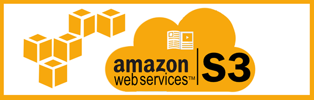
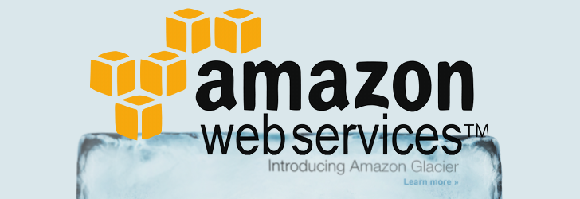

## Amazon Simple Storage Service (Amazon S3) and Amazon Glacier

Amazon S3 provides developers and IT teams with secure, durable, and highly-scalable cloud
storage.

- Object Storage with simple web interface:  store and retrieve any amount of data from anywhere on the web
- Allow to pay only what you use.
- One of the first AWS services (foundational web services).
- High level of integration with AWS Cloud services like:
   - AWS IAM, AWS KMS, Amazon EC2, Amazon EBS, Amazon EMR, Amazon Dynamo DB, Amazon Redshift,
Amazon SQS, AWS Lambda, and Amazon Cloud Front.

---

## Common use cases for Amazon S3 storage include:
- Content, media, and software storage and distribution
- Big data analytics
- Static website hosting
- Cloud-native mobile and Internet application hosting
- Disaster recovery

## Amazon S3 storage classes
- General Purpose
- Infrequent access
- Archive
  - S3 Offers lifecycle policies: Permissions, ACL and Encryption.

---

## Amazon Glacier Cloud Storage Service

- Optimized for data storage and long-term backups (low cost) online backup.
- Retrieval of 3 to 5 hours.
- Use as storage class of S3 and / or independent storage service
- Designed for extreme durability 99.999999999% over a given year.
- Any kind of data, in any format. Typical Storage: TAR or ZIP files.
  - <u>Archives:</u> contain up to 40TB of data (unlimited # of files),
    each archive have a unique ID, automatically encrypted, immutable: not modified after created.
  - <u>Vaults:</u> containers for archives, up to 1000 Vaults per AWS account. Control using IAM policies or vault access policies.
  - <u>Vaults Locks:</u> Compliance Controls like WORM (Write Once Read Many) not change the policy.
  - <u>Data Retrieval: </u> Up to 5% free each month. More than 5% => Retrieval Fees. Set a policy for this.  

---

## Object Storage Vs. Traditional Block and File Storage

- <u>Block Storage:</u> Low  level number (raw), and manage data as fixed-size blocks
- <u>File Storage:</u> High level OS level: structure and hierarchy of files / folders
- Both accessed from a Storage Area Network (SAN):
  - Protocols: Fibre Channel, iSCSI, Network attached storage (NAS) file server
    - Over NFS (Network File System) or CIFS (Common Internet File System)
- All depends of the OS / Server.

 <u>Amazon S3:</u>
<i>Objet Storage</i> Server independent and accessed over the Internet
  - Use and API based on standard HTTP.
  - Each object contains data and metadata.
  - Objects reside on <b><i>buckets</i></b> and identified by unique user-specific key.
  - Buckets are flat folder with no File System: unlimited # of objects. No sub-buckets.
  - Operations: GET and PUT
  - No worry to replication, capacity planning, scalability: S3 automatically partitions buckets to support high request, replicate across regions and simultaneous access users.

---

## Amazon S3 Basics - Buckets
- <u>Bucket:</u> Container (web folder) for objects (files) stored in Amazon S3.
- Bucket Names are global, unique, like DNS, up tp 63 lowercase letters, #, hyphens, and periods.
- Up to 100 buckets per account by default.

# AWS regions
- Every bucket created in a specific region. Control where is stored, unless specify copy to another region.

---

# Objects
- Objects are the entities or files on AWS S3. Store any kind of data / any format.
- From 0 bytes to 5TB, single bucket can store unlimited number of objects.
- Object: Data (the file itself: stream of bytes) and Metadata (about file: set name/value pairs describe the object).
- <u>Metadata:</u>
    -  System metadata (by Amazon s3 itself: last date, size, MD5 digest, HHTP Content-Type )
    -  User metadata: Optional specified at the time object created. Custom metadata.

---

# Keys
- Every object identified by a <i>key</i> (like filename): 1024 bytes Unicode UTF-8 chars.
- Keys unique in single bucket. Different buckets can have same key.
- Combinations of key/bucket and optional version ID identify an Amazon S3 object.

# Object URL
- Every object accessed by an unique URL used the web services endpoint, bucket, object key.
- Example: http://marioceron.com.s3.amazonaws.com/test/Chapter02-S3.PNG
 where: marioceron.com = bucket name, /test/Chapter02-S3.PNG = key or filename (include the / \ ) No file and folder hierarchy.

---

# Amazon S3 Operations: Amazon S3 API
- Create/delete a bucket.
- Write an object.
- Read an object.
- Delete an object.
- List keys of a bucket.

---

# REST (Representational State Transfer) API
- Use standard HTTP/HTTPS: Create / delete buckets, list keys, read/write objects,
- Maps HHTP "Verbs" (HTTP Methods) to familiar CRUD
  (Create : PUT /POST, read: GET, Update: POST, Delete: DELETE).
- interfaces: AWS Software Development Kits (SDKs) for:
  - iOS, Android, JavaScript, .NET, Node.js, PHP, Python, Ruby, Go, C++.
  - AWS CLI (Command Line Interface) and AWS Management Console.
  - Legacy HTTPS endpoint supported. Originally supported SOAP API.

---

# Durability and Availability
- Durability: 99.999999999% and Availability 99.99% over a given year.
- Example: 10.000 objects on S3 lost of single object once every 10.000.000 years.
- Multiples devices within a region. Concurrent loss of data in 2 facilities without loss of user data.
- Designed for Mission-Critical and primary data storage.
- For non-critical: Use RRS (Reduced Redundancy Storage) at lower cost (99.99% durability).
- Additional features: versioning, cross-region replication and MFA Delete for accidental user deletion.

---

# Data Consistency
- Amazon S3 is an <i>Eventually Consistent</i> system.
- Data replicated cross servers, changes in data take some time to propagate, some cases after update / delete data may return stale data. Not for new objects, S3 have (read-after-write) consistency.
- Updates are Atomic (for eventually Consistent) ensure non inconsistent mix of data.

---

# Access Control
- Amazon S3 secure by default. Create bucket / object only you have access. For allow control to others Amazon S3 provides:
  - ACLs (Access Control Lists)
  - Fine-grained access controls: Amazon S3 bucket policies, AWS Identity and Access Management (IAM) policies and Query-String authentication.
- ACL permissions: READ,WRITE or FULL-CONTROL at object / bucket level. Legacy control create before IAM existed. Use cases: enabling bucket logging / make bucket for Static website world-readable

- Amazon AWS S3 Bucket policies similar to IAM policies, different on:
 - Associated with the bucket resource instead of an IAM principal.
 - Include explicit reference to the IAM principal in the policy (It can  be Associated to a different AWS account).
- AWS S3 Policy: Who access the bucket, from where (IP address or inter-domain routing block CIDR), and what time of day.
- IAM policies may be associated with IAM principal that grant access to an Amazon S3 bucket. Only assign IAM policies to principals in AWS that have control.

---

# Static Website Hosting

- Use for static websites (No PHP,JSP, ASP.NET dynamic), or some client-side scripts like JavaScript embedded in static HTML webpages.
- Static websites are fast, very scalable, more secure than typical dynamic website.
- A bucket have a URL it can be relatively easy to turn a bucket a static website:
  - Create a bucket
  - Upload content static files to the bucket
  - Make all files public (World readable)
  - Enable static website hosting for the bucket. (Index and error document).
  - Website available at the S3 website URL: bucket-name.s3-website-<AWS-region>.amazonaws.com.
  - Create friendly DNS name for won domain for the website using a DNS CNAME or use Amazon Route 53 alias that resolves to the Amazon S3 website URL.
  - Test the website.

---

# Amazon S3 Advanced Features
High durability, low latency, high performance object storage:
- <b>Prefixes and Delimiters:</b> Like folders / subfolders delimiters : example: / or \ supported by REST API, wrapper SDK, AWS CLI and Management Console. Organize new data and maintain folder hierarchy. With IAM can be combined for access or sharing "subdirectories" / "home directories" within a single bucket restricting access defined by prefixes: logs/2016/January/server42.log

- <b>Storage Classes:</b>
  - <u>Standard:</u> It delivers low first-byte latency and high throughput. Standard place to start.
  - <u>Standard Infrequent Access (Standard-IA):</u> Lower per GB-month cost than Standard, and minimum object size (128KB), minimum duration (30 days), and per-GB retrieval cost. For data stored longer than 30 days.
  - <u>Reduced Redundancy Storage (RSS):</u> Lower durability (4 nines) than Standard / IA at reduced cost. For derivate data like image thumbnails.

---

  - <u>Amazon Glacier:</u> Extremely low cost cloud storage for data not require real-time access. (Long term backups). Hours retrieval. For retrieval use the S3 API (3 to 5 hours later) the object is copied to Amazon RRS. Allows to retrieve up to 5% of the Amazon S3 data on Amazon Glacier for free each month, the rest is a restore fee. (Policy data retrieval can be applied here)
    - Also a stand alone storage service, with a separate API and unique characteristics.

---

# Object Lifecycle Management
- Object lifecycle management policies can be used to automatically move data between storage classes based on time.

- Amazon S3 Object Lifecycle Management roughly equivalent to: storage tiering.
- <u>Data</u> :
  -  (Hot) Frequently accessed.
  -  (Warm) Less frequently accessed).
  -  (Cold) Long-term backup/archive.

Amazon S3 lifecycle configuration rules: reduce storage costs by transitioning data from one storage class to another.
Example lifecycle rules for backup : (applies to a entire bucket or specific objects by a prefix)
- Store backup data initially in Amazon S3 Standard.
- After 30 days, transition to Amazon Standard-IA.
- After 90 days, transition to Amazon Glacier.
- After 3 years, delete.

---

# Encryption
- Amazon S3 data can be encrypted using server-side encryption (SSE) or client-side encryption, and encryption
keys can be managed with Amazon Key Management Service -KMS (256 bit AES).
- SSE-KMS (AWS KMS Keys): Full solution AWS: permissions for master key, auditing, fail attempts
- SSE-C (Customer-Provided Keys): Full control keys encrypt/decrypt
- Client-Side Encryption: Use AWS KMS master key.  Use a client-side master key.

# Versioning & MFA (Multi Factor Authentication) Delete
- Versioning (on bucket level) and MFA Delete can be used to protect against accidental deletion.
- MFA with additional authentication to delete an object or change versioning.

---

# Pre-signed URLs
- For access an object URL : create a pre-signed URL: security credentials, bucket name, object key, HTTP method (GET), expiration date/time.
- Prevent -content scraping- of web content.

# Multipart upload API
- For objects larger than 100Mb, and must use for 5Gb. Automatically by AWS CLI (cp, mv, sync) for large objects.

---

# Range GETs
- Download a portion of object on Amazon S3 / Glacier.
- Range HTTP header in GET request or SDK wrapper libraries for a range of bytes of the object.

# Cross-Region Replication
- Cross-region replication can be used to automatically copy new objects from a source bucket
in one region to a target bucket in another region. Enabled for source/destination buckets and IAM policy.

# Logging
- Server access logs can be enabled on a bucket to track requestor (IP address), object, action (get, put, list...), and response.

---

# Event Notifications
- Amazon S3 event notifications can be used to send an Amazon SQS or Amazon SNS message
or to trigger an AWS Lambda function when an object is created or deleted.
- Setup at the bucket level, configure by AWS console or REST API or AWS SDK (PUT, POST, COPY, Multipart upload, DELETE) or RRS object lost.

---

# Pricing Example Comparison:

 For Region: US East (Ohio): https://aws.amazon.com/s3/pricing/
- For : 50 TB/ month on <b>S3</b> cost: $0.023 x 50.000 = us$ 1.150
- For : 50 TB/ month on <b>Glacier</b> cost: $0.004 x50.000 = us$ 200

---

# Differences between Amazon Glacier and Amazon S3  
- Glacier: 40 TB archives vs. S3: 5 TB.
- Glacier: system generated archive ID vs. S3: friendly key names.
- Glacier: encrypted automatically vs. S3 : optional encryption.
- Using Amazon Glacier as Amazon s3 Storage class together with object lifecycle policies => use S3 interface for Glacier.

---

## Practice with AWS account: AWS S3 Console
- Create an user on Identity and Access Management IAM Console:
  - marioceron
- Create a bucket: marioceron.com
  - Create a folder for example: mario, test
  - Upload files

---

## AWS CLI:
http://docs.aws.amazon.com/cli/latest/userguide/awscli-install-windows.html
- Install package and add on machine the PATH, then configure with:
   <b><i>aws configure</i></b>
  -  Requires AWS key and Secret Key

---

## S3 Client: Cyberduck
- On Windows / OSX :  https://cyberduck.io/?l=en

