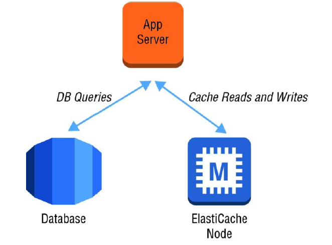

class: center, middle

## Amazon Simple Storage Service (Amazon S3) and Amazon Glacier
Amazon S3 provides developers and IT teams with secure, durable, and highly-scalable cloud
storage.
- Object Storage with simple web interface:  store and retrieve any amount of data from anywhere on the web
- Allow to pay only what you use.
- One of the first AWS services (foundational web services).
- High level of integration with AWS Cloud services like:
   - AWS IAM, AWS KMS, Amazon EC2, Amazon EBS, Amazon EMR, Amazon DynamoDB, Amazon Redshift,
Amazon SQS, AWS Lambda, and Amazon CloudFront

---

## Common use cases for Amazon S3 storage include:
- Content, media, and software storage and distribution
- Big data analytics
- Static website hosting
- Cloud-native mobile and Internet application hosting
- Disaster recovery

## Amazon S3 storage classes
- General Purpose
- Infrequent access
- Archive
  - S3 Offers lifecycle policies: Permissions, ACL and Encryption.

---

## Amazon Glacier Cloud Storage Service
- Optimized for data storage and long-term backups (low cost).
- Retrieval of 3 to 5 hours.
- Use as storage class of S3 and independent storage service

---

---

---

---

## Cache-aside Pattern

---

---

---

---
