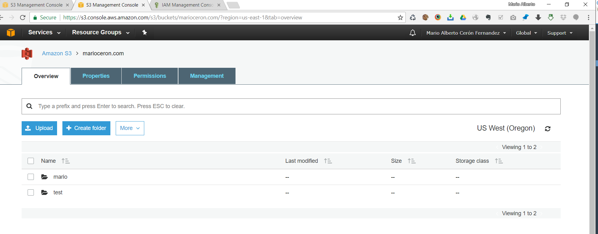

class: center, middle

## Amazon Simple Storage Service (Amazon S3) and Amazon Glacier

Amazon S3 provides developers and IT teams with secure, durable, and highly-scalable cloud
storage.
- Object Storage with simple web interface:  store and retrieve any amount of data from anywhere on the web
- Allow to pay only what you use.
- One of the first AWS services (foundational web services).
- High level of integration with AWS Cloud services like:
   - AWS IAM, AWS KMS, Amazon EC2, Amazon EBS, Amazon EMR, Amazon DynamoDB, Amazon Redshift,
Amazon SQS, AWS Lambda, and Amazon CloudFront

---

## Common use cases for Amazon S3 storage include:
- Content, media, and software storage and distribution
- Big data analytics
- Static website hosting
- Cloud-native mobile and Internet application hosting
- Disaster recovery

## Amazon S3 storage classes
- General Purpose
- Infrequent access
- Archive
  - S3 Offers lifecycle policies: Permissions, ACL and Encryption.

---

## Amazon Glacier Cloud Storage Service

- Optimized for data storage and long-term backups (low cost).
- Retrieval of 3 to 5 hours.
- Use as storage class of S3 and / or independent storage service

---
## Object Storage Vs. Traditional Block and File Storage

- <u>Block Storage:</u> Low  level number (raw), and manage data as fixed-size blocks
- <u>File Storage:</u> High level OS level: structure and hierarchy of files / folders
- Both accessed from a Storage Area Network (SAN):
  - Protocols: Fibre Channel, iSCSI, Network attached storage (NAS) file server
    - Over NFS (Network File System) or CIFS (Common Internet File System)
- All depends of the OS / Server.

 <u>Amazon S3:</u>
<i>Objet Storage</i> Server independent and accessed over the Internet
  - Use and API based on standard HTTP.
  - Each object contains data and metadata.
  - Objects reside on <b><i>buckets</i></b> and identified by unique user-specific key.
  - Buckets are flat folder with no File System: unlimited # of objects. No sub-buckets.
  - Operations: GET and PUT
  - No worry to replication, capacity planning, scalability: S3 automatically partitions buckets to support high request, replicate across regions and simultaneous access users.

## Amazon S3 Basics

## Practice with AWS account:

## AWS S3 Console
- Create an user on Identity and Access Management IAM Console:
  - marioceron
- Create a bucket: marioceron.com
  - Create a folder for example: mario, test
  - Upload files

## AWS CLI:
http://docs.aws.amazon.com/cli/latest/userguide/awscli-install-windows.html
- Install package and add on machine the PATH, then configure with:
   <b><i>aws configure</i></b>
  -  Requires AWS key and Secret Key

## S3 Client: Cyberduck
- On Windows / OSX

---

---

---

---

---

---

---
