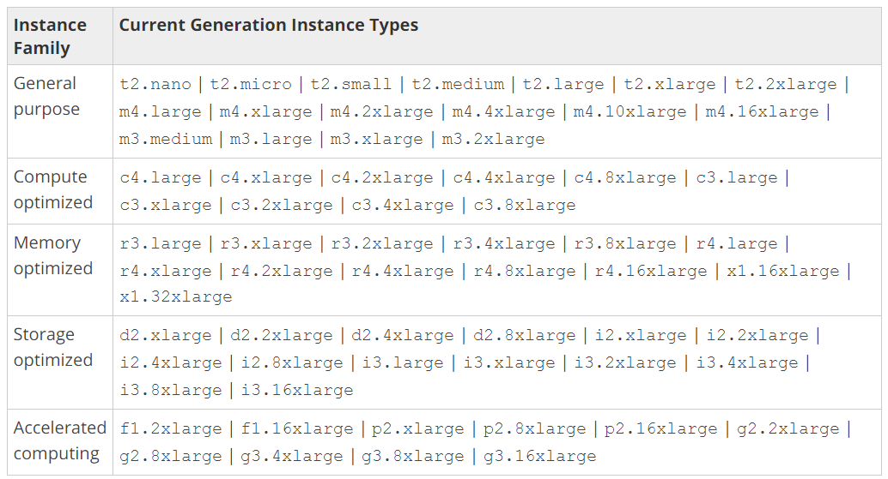
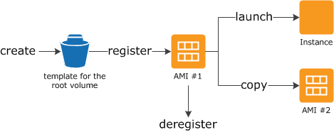
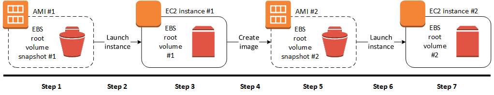
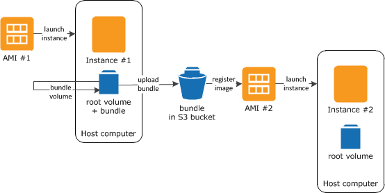
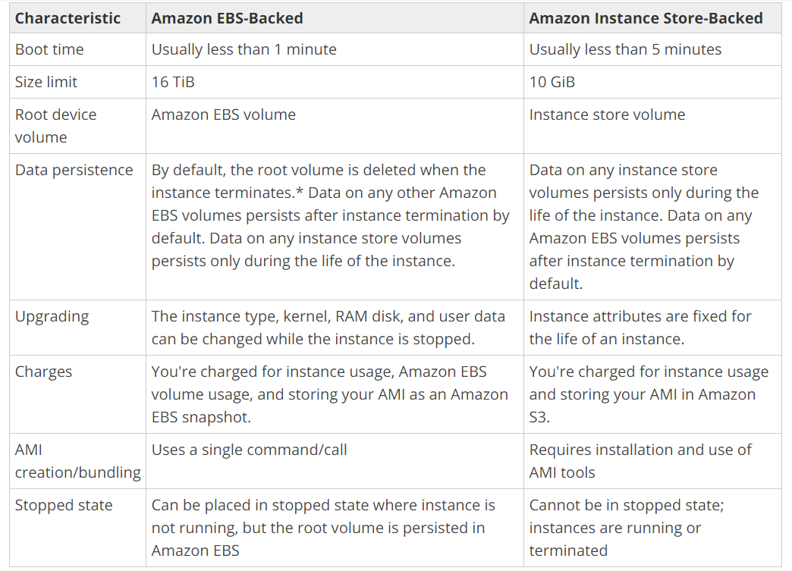

<h1 align= "center" style="margin-top: 3cm"> Amazon Elastic Cloud Compute</h1>
<h3 align= "center" style="margin-top: 3cm"> By Andres Gomez & Diego Gaitán</h3>

---

## Amazon Elastic Compute Cloud (Amazon EC2)

Amazon Elastic Compute Cloud (Amazon EC2) provides scalable computing capacity in the Amazon Web Services (AWS) cloud. EC2 allows you to acquire compute hardware (enough for your workload) through the launching of virtual servers called instances.

---

## Instances

Instances are the compute you can acquire by launching virtual servers. Depending on your needs, you can select different types of instances to suit them.

Instance types are available varying in the following dimensions:

 - vCPUs
 - Memory
 - Storage
 - Network performance

---

## AMI (Amazon Machine Image)

> An Amazon Machine Image (AMI) is a template that contains a software configuration (for example, an operating system, an application server, and applications).

An AMI includes the following:

 - A template for the root volume for the instance (for example, an operating system, an application server, and applications)
 - Launch permissions that control which AWS accounts can use the AMI to launch instances
 - A block device mapping that specifies the volumes to attach to the instance when it's launched

---

## AMI Types and Lifecycle

You can select an AMI to use based on the following characteristics:

 - Region
 - Operating system
 - Architecture (32-bit or 64-bit)
 - Launch Permissions
 - Storage for the Root Device (EBS or instance root device)

You can also Create your own AMI or buy, share or sell an existing one. (Shared AMI, Paid AMI)

---

## Copying AMIs

Cross-Region AMI Copy Benefits.

- Consistent global deployment: Copying an AMI from one region to another enables you to launch consistent instances based from the same AMI into different regions.
- Scalability: You can more easily design and build world-scale applications that meet the needs of your users, regardless of their location.
- Performance: You can increase performance by distributing your application, as well as locating critical components of your application in closer proximity to your users. You can also take advantage of region-specific features, such as instance types or other AWS services.
- High availability: You can design and deploy applications across AWS regions, to increase availability.

For process: [https://goo.gl/vccEih](https://goo.gl/vccEih)

---
## Tailoring your AMIs

You can create your own AMIs based off of existing published AMIs. This allows you to quickly deploy instances based on your needs.

In order to do so, you must first create an EBS backed instance. Afterward, on said instance you can perform any of the following actions to customize it:

- Install software and applications
- Copy data
- Reduce start time by deleting temporary files, defragmenting your hard drive, and zeroing out free space
- Attach additional Amazon EBS volumes

In the navigation pane, choose Instances and select your instance. Choose Actions, Image, and Create Image or Stop your instance (to maintain data integrity) and create an Amazon EBS Snapshot [https://goo.gl/pYKZx7](https://goo.gl/pYKZx7). Then create a new AMI from the created snapshot [https://goo.gl/b6Yqjv](https://goo.gl/b6Yqjv). Amazon will register the new AMI automatically.

---
The process is different for instance backed AMIs, you must bundle the instance with an S3 bucket in order to save the AMI in using the Bundle Instance (instance store AMI) in Instances.

You must then register the new AMI manually [https://goo.gl/YaocKX](https://goo.gl/YaocKX).

---

# Networking and Security

### Key Pairs

EC2 uses public-key cryptography to encrypt and decrypt login information.

### Create keys

- These can be created when you create the instance
- You can import your own keys
- Amazon EC2 only stores the Public key
- Amazon EC2 uses 2048-bit SSH2 RSA keys

### Launching and Connecting to Your Instance

 - When you launch the instance for the first time, you have to indicate which key you are going to use
  - You have to beware if you lose your private key because Amazon EC2 doesn't keep a copy of any key
 - When you are going to connect to the instance you have to specify the private key for that instance
 - If you don't specify any key, you won't be able to connect to the instance.

 ---

### Key Pairs for Multiple Users

If you have several users that need to access to a single instance [Check This](http://docs.aws.amazon.com/es_es/AWSEC2/latest/UserGuide/managing-users.html)
 - Create the users in the instance
 - Generate the key pair for every users
 - Add the public key in the .ssh/authorized_keys file for each user in your instance
 - Be sure that every user has his private key

### Connecting to Your Linux Instance if You Lose Your Private Key

 - This process is only supported tor EBS-backed instance [Check This](http://docs.aws.amazon.com/es_es/AWSEC2/latest/UserGuide/ec2-key-pairs.html#replacing-lost-key-pair)
  - Stop the instance
  - Detach the volume and attach to another instance
  - Launch that instance
  - Modify the authorized_keys file
  - Move back the volume to the original instance
  - Restart the instance

---

## Security Groups

- A security group acts as a virtual firewall that controls the traffic for one or more instances
- The rules are automatically applied to all instances that are associated with the security group

### Security Groups for EC2-Classic

- The security groups **HAVE** to be in the same region as the instance
- Once you launch a EC2-Classic instance you can't change its security groups, but you can add or remove rules for that security group, and those changes are automatically applied to **ALL** instances that are associated with that Security Group

### Security Groups for EC2-VPC

- You have to use security groups created specifically for you VPC
- You can't use a security group created for EC2-Classic
- Security Groups for EC2-VPC have additional capabilities that aren't supported by security groups for EC2-Classic [Check This](http://docs.aws.amazon.com/AmazonVPC/latest/UserGuide/VPC_SecurityGroups.html#VPC_Security_Group_Differences)

---

### Security Group Rules

- The rules of a security group control the inbound traffic that's allowed to reach the instances that are associated with the security group and the outbound traffic that's allowed to leave them.
- Security group rules are always permissive; you can't create rules that deny access.
- Security groups are stateful
- You can add and remove rules at any time. Your changes are automatically applied to the instances associated with the security group
- You can assign multiple security groups to an instance

Every rule have
- **Protocol:** _TCP, UDP, ICMP_
- **Port range:** _(0-65535)_
- **ICMP type and code**
- **Source or destination:** _The source (inbound rules) or destination (outbound rules) for the traffic._
- **(Optional) Description:**

---

## Elastic IP Addresses

- An Elastic IP address is a static IPv4 address
- AWS do not support Elastic IP addresses for IPv6

### Elastic IP Address Basics

- When you associate an Elastic IP address with an instance or its primary network interface, the instance's public IPv4 address is released back into Amazon's pool of public IPv4 addresses.
- You can disassociate an Elastic IP address from a resource, and reassociate it with a different resource.
- If you disassociate an Elastic IP this one remains associated to you AWS account
- An Elastic IP address is for use in a specific region only.
- When you associate an Elastic IP address with an instance that previously had a public IPv4 address, the public DNS hostname of the instance changes to match the Elastic IP address.

---
## Storage

Amazon EC2 provides you with flexible, cost effective, and easy-to-use data storage options for your instances. Each option has a unique combination of performance and durability. These storage options can be used independently or in combination to suit your requirements.

 - Amazon Elastic Block Store
 An EBS volume behaves like a raw, unformatted, external block device that you can attach to a single instance
 - Amazon EC2 Instance Store
 Many instances can access storage from disks that are physically attached to the host computer.
 - Amazon Elastic File System (Amazon EFS)
 Amazon EFS provides scalable file storage for use with Amazon EC2. You can create an EFS file system and configure your instances to mount the file system. You can use an EFS file system as a common data source for workloads and applications running on multiple instances.
 - Amazon Simple Storage Service (Amazon S3)
 Amazon S3 provides access to reliable and inexpensive data storage infrastructure. It is designed to make web-scale computing easier by enabling you to store and retrieve any amount of data, at any time, from within Amazon EC2 or anywhere on the web.

---
## EBS Backed vs. Instance backed

All AMIs are categorized as either backed by Amazon EBS or backed by instance store. The former means that the root device for an instance launched from the AMI is an Amazon EBS volume created from an Amazon EBS snapshot. The latter means that the root device for an instance launched from	the AMI is an instance store volume created from a template stored in Amazon S3.

---

## Pricing

Amazon EC2 provides 4 ways to pay for instances. On-Demand, Reserved Instances, Spot Instances and Dedicated Hosts

Depending on the use case of the instance that you are setting up, you need to be wary of your billing selection, as it is the job of any Cloud Solution Architect to provide the solution at the performance level required, with the least amount of impact to budget.

---
###  On-Demand

With On-Demand instances, you pay for compute capacity by the hour with no long-term commitments or upfront payments.

On-Demand instances are recommended for:
 - Users that prefer the low cost and flexibility of Amazon EC2 without any up-front payment or long-term commitment
 - Applications with short-term, spiky, or unpredictable workloads that cannot be interrupted
 - Applications being developed or tested on Amazon EC2 for the first time

---

###  Spot Instances

Amazon EC2 Spot instances allow you to bid on spare Amazon EC2 computing capacity for up to 90% off the On-Demand price.

Spot instances are recommended for:
 - Applications that have flexible start and end times
 - Applications that are only feasible at very low compute prices
 - Users with urgent computing needs for large amounts of additional capacity
