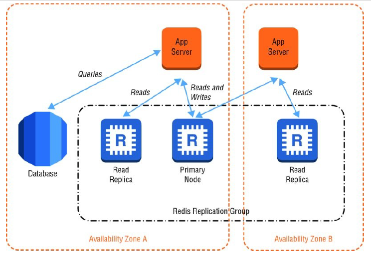

class: center, middle

## Amazon Elasticache!

---

## Why use in-memory Caching?

  - Retrieving data from a database is an expensive operation

  - A response time increase can draw away customers from a site
  
  - Moving frequently accessed data in-memory will improve the responsiveness of an app

---

## Amazon Elasticache 

  - Web service that simplifies the setup and management of distributed in-memory caching environments

  - Easy and cost effective to provide a high-performance and scalable caching solution for your cloud applications

  - It uses either Memcached or Redis

---

## Memcached? Redis?

  - Memcached

    - key/value store that can be used to store arbitrary types of data

  - Redis:

    - In-memory data structure store
  
    - can be used as a cache, database, or even as a message broker

---

## Amazon Elasticache 

  - You can start using it right away with your memached/redis supported applications

  - You can implement any number of caching patterns
  
---

## Cache-aside Pattern

---

## Cache-aside Pattern

- The app server checks the cache first to see if it contains the data it needs. If the data does not exist in
the cache node, it will query the database and serialize and write the query results to the
cache. The next user request will then be able to read the data directly from the cache instead
of querying the database.

---

## Data Access Patterns

  - Retrieving data from an in-memory cache will always be faster than the most optimized db query

  - You should evaluate how the data is accessed before you decide to store it in a cache.

  - Protip: cache data like a list of items on a catalog

  - Noobtip: cache data that changes often (security tokens, real time)

---

## More on memcached and redis

  - Memcached

    - Very simple interface that allows you to write and read objects into in-memory key/value data stores

    - EC allows cluster resizing, partitioning and parallel operation for high throughput 

    - Deals in blobs that are retrievable using a key

    - Updates are allowed by amazon each time a new memcached version is released

  - Redis:

    - Can deal with blobs, strings, lists, sets, and other rich data types
  
    - Allows in-memory data to be persisted to disks (Allows snapshots and recovery)

    - Supports up to five read replicas that can be promoted in case of a disaster

    - Features for data ranking and sorting

---
 

## Nodes and Clusters - How EC is actually deployed?

  - One or more nodes in a cluster
  
  - Memcached can have up to 20 nodes, Redis..... just 1 but with read replicas

  - Node types are derived from instance type families (Like the ec2 instancess)

  - AWS will provision new nodes in case of failure, however, take precautions

---

class:center, middle 
## For memcached elasticache supports auto discovery, which gives your applications the ability to identify automatically all of the nodes in a cache cluster and to initiate and maintain connections to all of these nodes!   

---

## Scaling

  - You can scale your cluster horizontally and "vertically", but depends on the engine

  - Memcached can partition your data and scale horizontally to like a bunch of nodes (20)

  - Redis clusters can only scale with read replicas.

  - Vertical scaling can be achieved by spinning up a new cluster (memcached can only start empty!)

---

class:center, middle 
## Talking about memcached clusters only being able to start empty......You can (and should) use replication with redis clusters, but not with memcached as its clusters are standaolne in-memory services.

---

class:center, middle 

---

## "Backuping" and "snapshoting"

  - You can't do it with memcached, period

  - With redis snapshots can be created manually or automatically, and will be stored in s3

  - Snapshots will hinder the performance of the cluster, so try to perform snapshots agains read replicas

  - You can set retention periods for automatic snapshots, manual ones will be stored indefinitely

  - Restoring a cluster is basically creating a new one

---

## Mandatory security slide

  - Use security groups to protect your cluster (aws firewall)

  - Individual nodes can NEVER be accessed from networks different than the one they were created

  - You can use Network ACL's

  - Restrict the access to the configuration of the infrastructure of the cluster, using IAM

  - Restoring a cluster is basically creating a new one

  - For aws nerds, the actions that are commonly used for policies to manage a cache cluster are: CreateCacheCluster, ModifyCacheCluster and DeleteCacheCluster

---